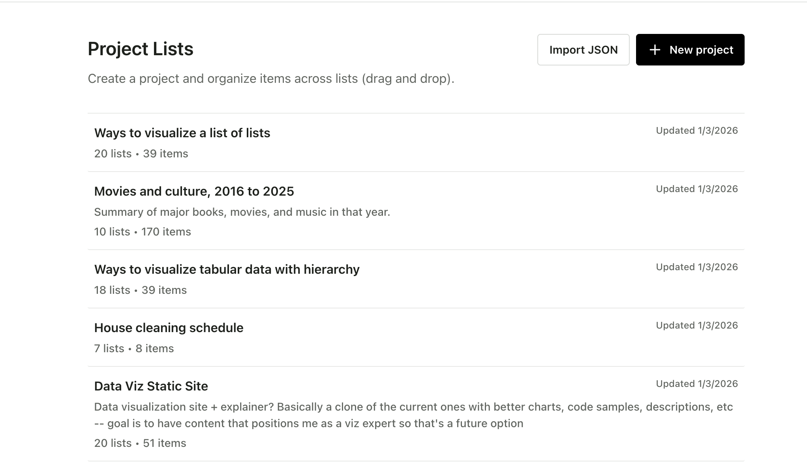
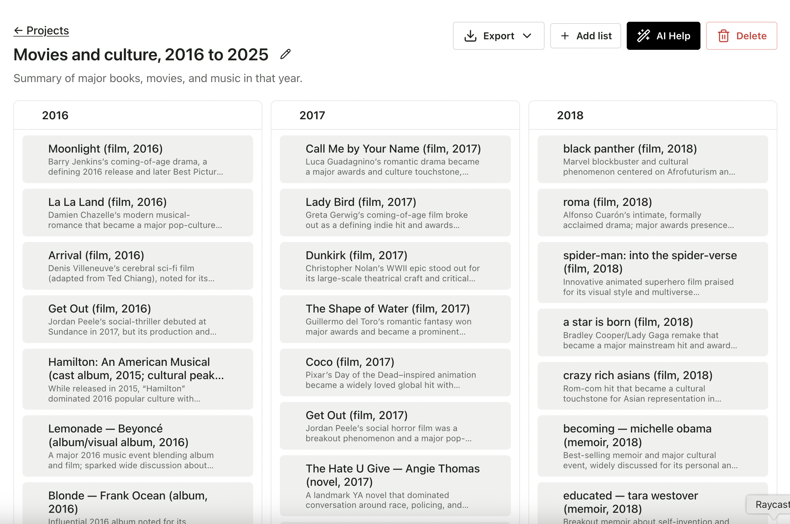

# Prod Ideator (LLM List Maker)

A lightweight, AI-assisted workspace for turning a project idea into a structured board of lists and items. It’s designed to help you quickly brainstorm, organize, and refine scope—then export the result as portable JSON or readable Markdown.

<!-- Screenshot placeholder: Home page -->

<!-- Screenshot placeholder: Project detail / board page -->

## What this app is for

- **Capture a project idea**: Give a project a title and description so the intent is clear.
- **Organize work visually**: Break the project into lists (columns) and items (cards/rows) you can move around.
- **Accelerate ideation with AI**: Generate initial structure and content, or reorganize what you already have.
- **Export and share**: Download the board as JSON for portability, or as Markdown for docs and discussions.

## Main pages

### Home (`/`)

The home page is the hub for managing projects.

- **Project list**
  - Shows your existing projects.
  - Displays basic metadata like **last-updated date** and **counts of lists and items**.
- **Create a new project**
  - Provide a **title** and an optional **description**.
  - Creating a project takes you directly to its board page.
- **Import a project**
  - Import via **file picker** or **drag-and-drop**.
  - Supports:
    - A single project JSON shaped like `{ project, lists, items }`
    - A legacy “db JSON” export (for migrating older data)

### Project detail / board (`/projects/:id`)

Each project has a board page that combines project-level context, AI tools, and a drag-and-drop grid of lists and items.

#### Project header

- **View + edit project details**
  - Edit the project **title** and **description** in place.
- **Export the whole board**
  - **Download JSON**: A complete, structured export of the project board.
  - **Download Markdown**: A readable document version of the board.
  - **Copy as Markdown**: Copies the Markdown export to your clipboard.
- **Delete project**
  - Permanently deletes the project and all of its lists and items.

#### Lists (columns)

- **Add list**
  - Create a new list with a **title** and optional **description**.
- **Edit list**
  - Update list title/description directly from the column header.
- **Delete list**
  - Removes the list (and its associated organization on the board).
- **Reorder lists (drag-and-drop)**
  - Lists can be reordered horizontally using the **drag handle** in the column header.
- **Export a single list**
  - Each list can be exported as Markdown:
    - **Download Markdown**
    - **Copy as Markdown**

#### Items

- **Add items to a list**
  - Each list includes an “Add item” control for creating new items.
  - Items include a **label** and an optional **description**.
- **Edit and delete items**
  - Items can be edited in place (label/description) and deleted.
- **Move items (drag-and-drop)**
  - Drag items within a list to reorder them.
  - Drag items across lists to change where they live.
  - Dropping into a column body moves the item to the end of that list.
- **Loose items**
  - Items can exist without a list assignment (“Loose”).
  - When present, a **Loose** column appears to collect unassigned items.

#### AI tools

The board includes two AI capabilities: **AI Help** (make changes) and **AI review** (reflect and ask questions).

- **AI Help**
  - Optional free-form instructions (treated as the highest priority).
  - Configurable actions:
    - **Create lists** (suggest new columns)
    - **Create items** (suggest new items and assign them to lists or “Loose”)
    - **Move items around** (reorganize existing items into better-fitting lists)
  - Apply the AI’s changes to the board in one action.
- **AI review**
  - Produces:
    - **Commentary** on the current structure and organization
    - A set of **high-signal questions** to improve clarity and completeness

## Exports at a glance

- **Board JSON**: Best for portability and re-importing later.
- **Board Markdown**: Best for sharing in docs, PRDs, or discussion threads.
- **List Markdown**: Useful when you want to share or document one slice of the board.
